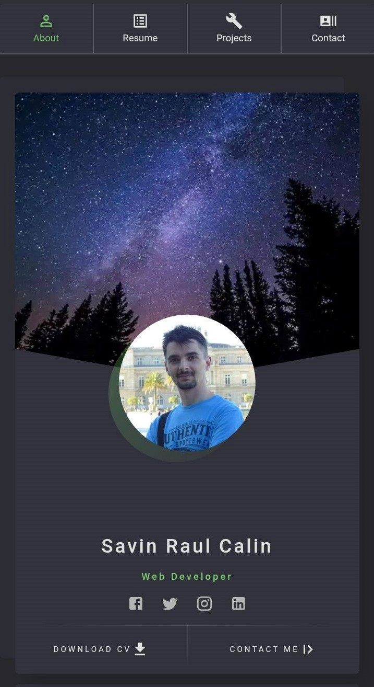
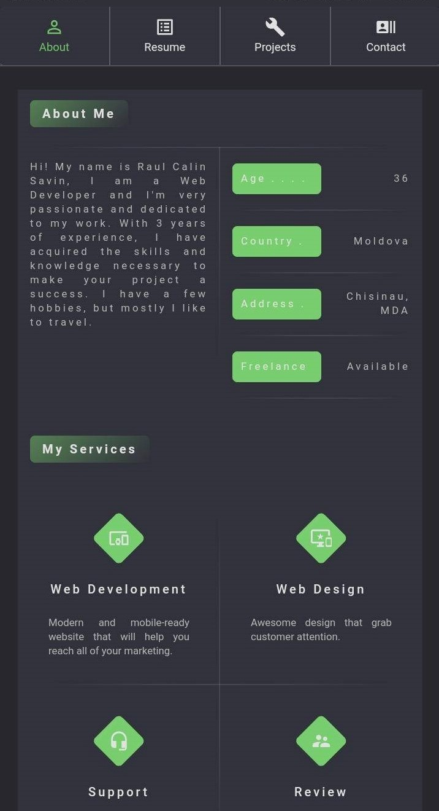
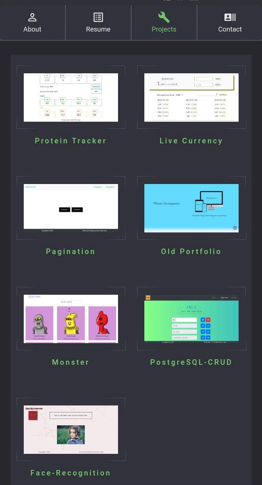
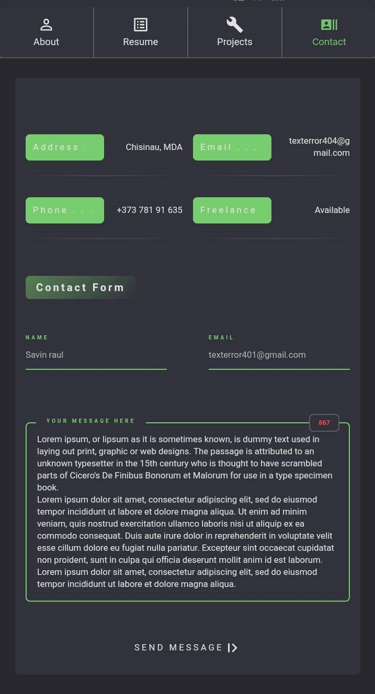

# Portfolio

## Screenshots
| Portfolio | About Me | Resume | Projects | Contact |
|:----:|:----:|:----:|:----:|:----:|
| |  | | | 

## Built With
- Front-end
  - "@material-ui/core": "^4.7.1",
  - "@material-ui/icons": "^4.5.1",
  - "@material-ui/styles": "^4.7.1",
  - "babel-plugin-styled-components": "^1.10.6",
  - "bootstrap": "^4.4.1",
  - "classnames": "^2.2.6",
  - "dotenv": "^8.2.0",
  - "gatsby": "^2.18.4",
  - "gatsby-background-image": "^0.9.11",
  - "gatsby-image": "^2.2.34",
  - "gatsby-plugin-manifest": "^2.2.30",
  - "gatsby-plugin-material-ui": "^2.1.6",
  - "gatsby-plugin-offline": "^3.0.24",
  - "gatsby-plugin-react-helmet": "^3.1.16",
  - "gatsby-plugin-sass": "^2.1.24",
  - "gatsby-plugin-sharp": "^2.3.4",
  - "gatsby-plugin-styled-components": "^3.1.14",
  - "gatsby-source-filesystem": "^2.1.39",
  - "gatsby-transformer-sharp": "^2.3.6",
  - "google-map-react": "^1.1.5",
  - "prop-types": "^15.7.2",
  - "react": "^16.12.0",
  - "react-dom": "^16.12.0",
  - "react-helmet": "^5.2.1",
  - "react-textarea-autosize": "^7.1.2",
  - "styled-components": "^4.4.1",
  - "validator": "^12.1.0"